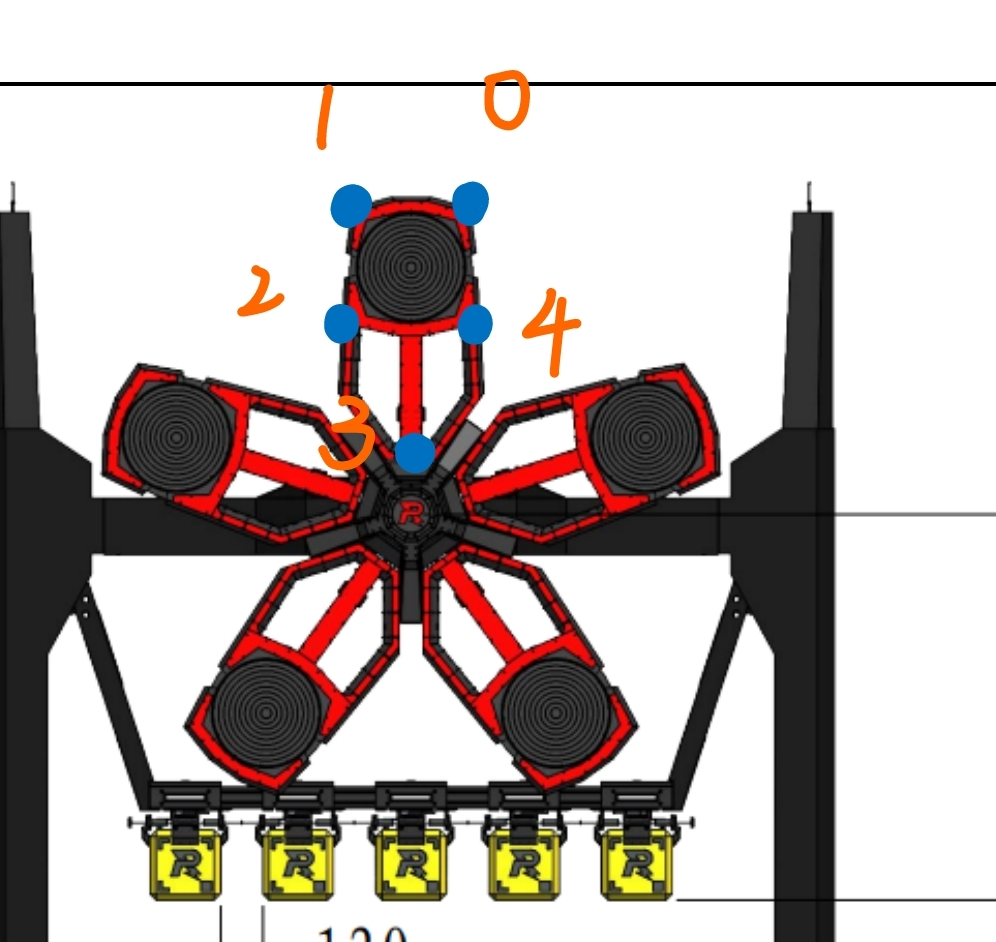

# RoboMaster Season 2023 Rune's labels Transforming Tool

~~本repo用于从[上交开源数据集制作工具](https://github.com/Spphire/RM-labeling-tool)制作的能量机关数据集转化为yolo多关键点检测的格式。~~
上交已内置转换，本repo暂时废置，仅用于对未转换的label使用。或者用于分离训练集和测试集
即: 
将
```
[class x1 y1 x2 y2 x3 y3 x4 y4 x5 y5]
转化为
[class x y w h x1 y1 x2 y2 x3 y3 x4 y4 x5 y5]
的格式
并且将图片缩小至原来minification倍(原来的图片太大了)
```

# tree
```
├── converted_images
├── converted_labels
├── images_jpg
├── images_png
├── labels
├── test
├── modify_label.py
├── train
│   ├── images
│   └── labels
└── val
    ├── images
    └── labels
```
```
converted_images    缩小后的图片文件夹
converted_labels    修改后的lables文件夹
images_jpg          放置原始jpg格式图片的文件夹
images_png          放置原始png格式图片的文件夹
labels              放置原始labels的文件夹
test                测试集
train               训练集
val                 验证集
```
modify_label的main里面有三个函数
draw 用于确定点的顺序
write 修改图片和labels后放到conveted_images/labels
seperate 用于将converted_images/labels 里面的数据按照一定比例分为验证集与数据集
test 建议用视频

### Author: HDU PHOENIX exia qq:2370632172

# tips
~~有用的话求个star(~~

不要混入装甲板数据或者已经转为yolo face的labels

主程序为modify_label.py

需要python配置了opencv环境

在进行labels转换前，请调用draw()确认，上交给的数据集的标注顺序如下
